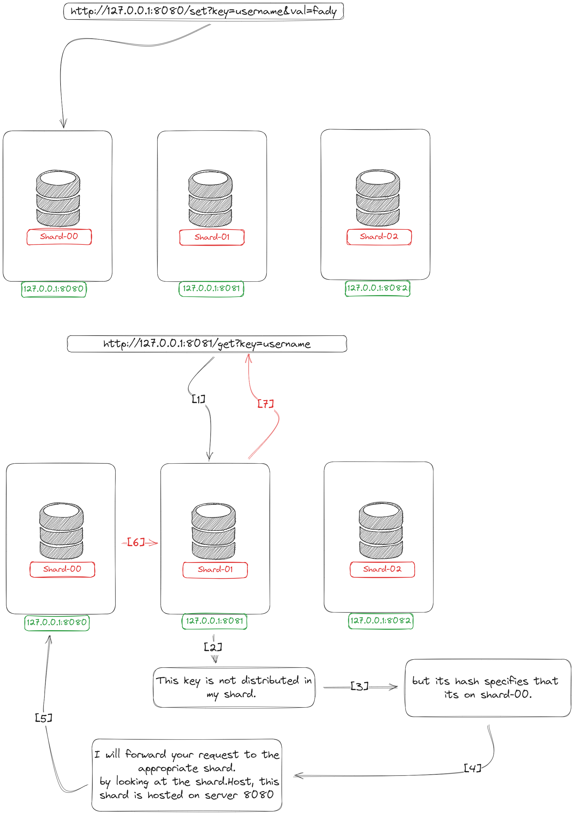

# Current Design of V.1.0: 

- Its not safe to store all our data in only one database, so we will use replica for each database instance 
- btw replica is not backup 
    - replica is used if we have a faliure in our database so clients can still reach to the data 
    - backup in case of human error such as deleting all our data in database accediently

- the magic part is distributing the keys, values, requests over all servers
- each shard holds unique set of keys
- so we need to implement a way to divide the shards across the keys
- how we distribute the keys across shards :-
    - hash(key) % len(shards) = x 
    - if x == current_shard.index --> this key goes to this shard 

